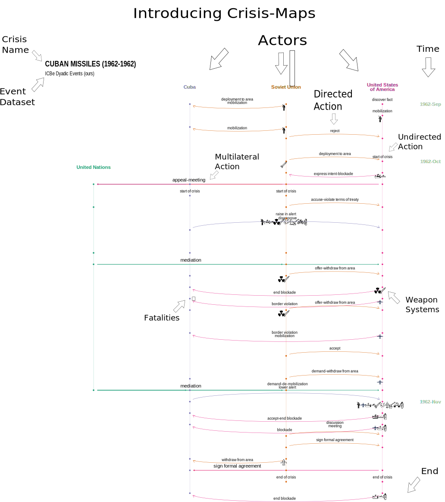
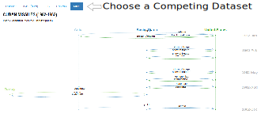
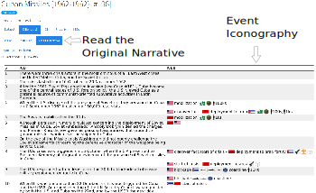

```{r renderwholesite, eval=F, echo=F}

library(tidyverse)

template <- readLines("_crisis_template.Rmd")
length(template)

icb_crises <-read_csv(paste0(here::here(), "/data_in/icb1v14.csv") ) %>% filter(crisno<=476 & crisno!=475 & !is.na(yrtrig)) #Always subset to just what we have

#conflict_data_long_singlecode_icb <- readRDS("/mnt/8tb_a/rwd_github_private/icbe/conflict_data_long_singlecode_icb.rds") %>% separate(dataset_identifier, c("a", "b"), sep='_') %>% mutate(crisno=b %>% as.numeric())
crises <- icb_crises$crisno %>% unique()

library(glue)
for(crisis in crises){
  i=which(icb_crises$crisno==crisis)
  section <- paste0(icb_crises[i,]$crisname %>% stringr::str_to_title()," (", icb_crises[i,]$yrtrig ,"-",icb_crises[i,]$yrterm,")", " [#", icb_crises[i,]$crisno,"]")

  header=paste(
  "---",
  glue::glue("title: \"{section}\""), #make sure you use double quotes or apastrophes in titles will break rmds
  "output: html_document",
  "---",
  "",
  "\`\`\`{r, echo=F}",
  "fromscratch=F", #Setting to false now that I've created one full run of images
  glue("crisis = {crisis}"),
  "\`\`\`",
  sep="\n"
  )
  writeLines(text=c(header, template), con=paste0(crisis,".Rmd"))
}

#The problem is this we failed to make the later ones, and it does these in order so when they fail they fail
#cannot open compressed file '/mnt/8tb_a/rwd_github_private/icbewebsite//images/ggplots/p_metro_plot_474.Rds', probable reason 'No such file or directory'

#Run this by hand
library(rmarkdown)
render_site(
  input = ".",
  output_format = "all",
  envir = new.env(),
  quiet = T,
  encoding = "UTF-8"
)
dir.create('/mnt/8tb_a/rwd_github_private/icbewebsite/docs/website_images/')
file.copy("/mnt/8tb_a/rwd_github_private/icbewebsite/images/website_images/", "/mnt/8tb_a/rwd_github_private/icbewebsite/docs/", recursive=TRUE)
#ok new plan, I'm going to just copy the folder over after it finishes rendering


```

```{js twitterwidget, class.source = "jsvis1", echo=F}

window.twttr = (function(d, s, id) {
  var js, fjs = d.getElementsByTagName(s)[0],
    t = window.twttr || {};
  if (d.getElementById(id)) return t;
  js = d.createElement(s);
  js.id = id;
  js.src = "https://platform.twitter.com/widgets.js";
  fjs.parentNode.insertBefore(js, fjs);

  t._e = [];
  t.ready = function(f) {
    t._e.push(f);
  };

  return t;
}(document, "script", "twitter-wjs"));

```

```{r, results='asis', echo=FALSE, warnings=F, message=F, echo=F, warnings=F}
library(tidyverse)
library(urltools); #install.packages('urltools')

text <- '\U1F6A8New Dataset Alert\U1F6A8

Want to understand international crises?

International Crisis Behaviors Events project (ICBe)
www.CrisisEvents.Org

475 Crises (1918-2015)
10k Human Coded Events

@Cpassucsd @RexDouglass'
Encoding(text) = "UTF-8"
text_encoded <- text %>% URLencode()

tweet <- glue::glue('<a class="twitter-share-button" href="https://twitter.com/intent/tweet?text={text_encoded}">Share</a>\'')

print(tweet)

```
  
ICBe is a new, free, high quality event dataset of over ten thousand events spanning 475 international crises from 1918 to 2015

ICBe was developed by the [Center for Peace and Security Studies](https://cpass.ucsd.edu/) at the University of California San Diego with support from the University of Maryland.

Read our introductory paper:

> “[Introducing the ICBe Dataset: Very High Recall and Precision Event Extraction from Narratives about International Crises](https://arxiv.org/abs/2202.07081),” Rex W. Douglass, Thomas Leo Scherer, J. Andrés Gannon, Erik Gartzke, Jon Lindsay, Shannon Carcelli, Jonathan Wiklenfeld, David M. Quinn, Catherine Aiken, Jose Miguel Cabezas Navarro, Neil Lund, Egle Murauskaite, and Diana Partridge, 2022.

## What is an international crisis?

A crisis, like the Cuban Missile Crisis, is "a change in the type or an increase in the intensity of disruptive interaction with a heightened probability of military hostilities that destabilizes states' relationships or challenges the structure of the international system" (Brecher and Wilkenfeld 1982).

Our project is based on the amazing corpus of crisis narratives written by the [ICB project](http://www.icb.umd.edu/dataviewer/).

## What are event data good for?

Event data let us describe and compare moments in history more easily.

For example, we can produce detailed timelines called crisis-maps. Here's an example of a map of the Cuban Missile Crisis with instructions for how to interpret each part.



## How is ICBe better than the state of the art?

ICBe is the first high recall AND high precision event dataset of international relations.

The paper provides detailed evaluations, but we suggest you simply compare for yourself crisis-maps produced by ICBe versus each of the existing state of the art datasets.



And compare each crisis-map to the original historical narratives.



## Where should I start?

1.  [Browse](browse.html) the crises. Every single datum of the project is visualized.

2.  Download the data and use it downstream in your own projects. All that we ask is you cite our introductory note.

3.  Spread word of this resource by sharing a crisis on social media. Each crisis has an auto-generated twitter link for starting a discussion around a specific historical episode.

4.  Find bugs! All code has bugs. Every crisis has direct links that will auto-start a github issue ticket so you can quickly tell us if you found a problem.
